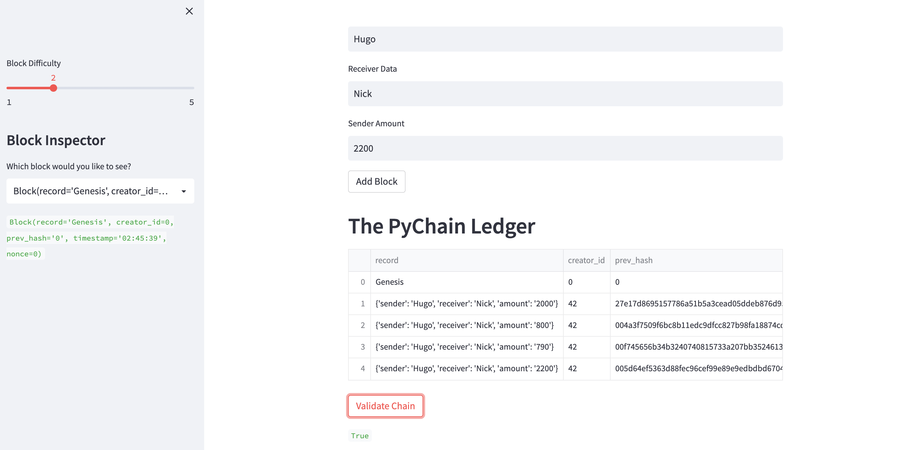

# Blockchain_Ledger_System

This Blockchain Ledger System has been designed to allow partner banks to conduct financial transactions while verifying the
integrity of the data. The application comes complete with a user-friendly web interface.


## Installations

```python
!pip install streamlit
```

## Technologies

This project uses Python and was operated on VSCode in conjuction with the following add-ons.


* [streamlit](https://streamlit.io/) - build and share data apps.

* [pandas 1.4.3](https://github.com/pandas-dev/pandas/blob/main/README.md) - cv files and operations.

* [hashlib](https://pypi.org/project/hashlib/) - secure hashes and message digests.


## Usage

For usage of this application `pychain.py` may be cloned and ran locally on terminal
or git bash with the following command of `streamlit run pychain.py`


### Image of Adding blocks 


### Image of Validating chain



# License
[MIT](license)

## Contributers
Hugo Velazquez

linkedin.com/in/hugoghvelazquez

